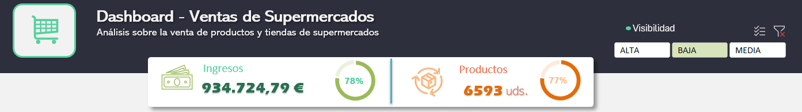
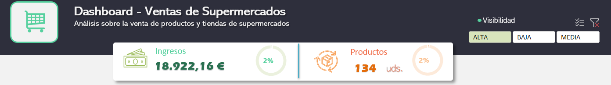
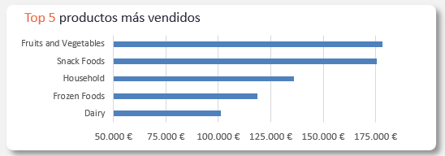
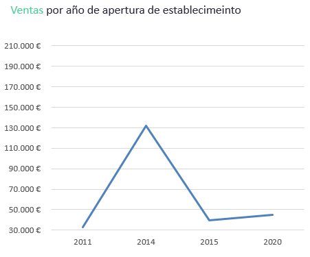
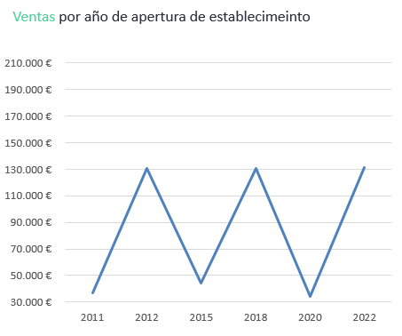
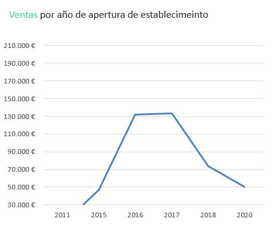
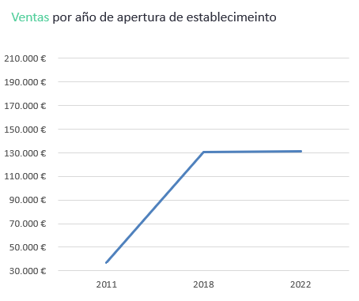

# 👔 Business Intelligence: Tomar Decisiones Estratégicas 📈 Analizando Datos 
Este proyecto realiza un análisis exhaustivo de las ventas de productos en una cadena de supermercados. El objetivo es identificar patrones de compra y entender cómo variables como la visibilidad del producto, el tamaño de la tienda, y su ubicación afectan las ventas. Este análisis se centra en extraer insights clave que pueden guiar decisiones estratégicas en la gestión de inventarios y nuevos locales.

## 🗂️ Estructura del Proyecto

Proyecto1-DashboardExcel/
```
├── DASHBOARD/ # Carpeta para el archivo de dashboard 
│ └── BlinkIT_Grocery_Data - Dashboard.xlsx 
│
├── DATOS/ # Carpeta para los datos en bruto y limpios 
│       ├── BlinkIT_Grocery_Data.xlsx # Datos originales 
│       └── BlinkIT_Grocery_Data - Datos_Limpios.xlsx # Datos limpios 
├── src/ # Carpeta para las imagenes utilizadas en el readme 
└── README.md # Archivo de documentación del proyecto
```


## 📊 Resultados y Conclusiones

1. **Visibilidad de Productos:** Los productos con menor visibilidad generan la mayor parte de las ventas. Esto sugiere que los clientes ya saben lo que quieren comprar y no dependen tanto de la exposición en la tienda para elegir los productos.





>  <span style=color:#4DA6FF> _Podemos notar que la diferencia en ingresos de aquellos productos con visibilidad alta y baja es notable (78% vs 2%)._ </span> 

2. **Preferencia de Productos:** Existe una inclinación hacia productos bajos en grasa y de primera necesidad. Quizás sea este el motivo por el que aquellos con visibilidad baja se venden igual (son productos básicos).



>  <span style=color:#4DA6FF> _Observamos que los cinco productos más vendidos son bienes de primera necesidad._ </span> 

3. **Tamaño de Tienda:** Cuanto más nuevos los supermercados no implica genear más imgresos. Esto plantea la posibilidad de que las características de los locales más nuevos (diseño, tecnología, o experiencia del cliente) no han evolucionado para atraer al público en la misma medida que los supermercados abiertos en 2014 o 2018. Pasa igual con los locales de tamaño grandes, que en este caso funcionan mejor aquellos inaugurados en 2014. Deberemos revisar los de tamaño mediano, ya que algunos representan un bajo nivel de ingresos con respecto a otros de su mismo nivel abiertos en años anteriores y posteriores. Por último, respecto a los locales pequeños, han perdido su capacidad de venta en los locas abiertos recientemente.


> <span style=color:#4DA6FF>Ventas generales por años </span> 


> <span style=color:#4DA6FF>Ventas de locales grandes por años </span> 


> <span style=color:#4DA6FF>Ventas de locales medianos por años </span> 


> <span style=color:#4DA6FF>Ventas de locales pequeños por años </span> 

4. **Ubicación de la Tienda:** Curioso que las tiendas de gran tamaño no tengan representación en aquellos lugares de Tier 1. Además, los de tamaño pequeño en los Tier 1 han bajado sus centas casi a la mitad. La única combinación que ha mejorado y se mantiene en el tiempo son los locales medianos situados en zonas de Tier 3: desde 2018 se han mantenido en ventas de 130.000€


> <span style=color:#4DA6FF>Ventas de locales medianos en ubicaciones Tier 3 </span> 

## Resumen
En definitiva, los datos muestran varios puntos clave:

+ **Los clientes llegan con una intención de compra clara**
+ **Fuerte preferencia por productos básicos y saludables**
+ **Los supermercados nuevos, especialmente los medianos y pequeños, no están logrando los mismos ingresos que aquellos abiertos en años anteriores**
+ **No hay tiendas grandes en las mejores ubicaciones (Tier 1), y que los locales pequeños en estas áreas están viendo una caída en sus ventas**
+ **Los supermercados medianos en zonas menos competitivas (Tier 3) han mantenido ingresos estables, lo que sugiere que pueden tener una clientela más fiel** 

## 🔄 PRÓXIMOS PASOS
 - Datos
     - Incluir datos sobre el margen de ganancia por producto para obtener un análisis financiero más completo que permita identificar los productos más rentables, no solo los más vendidos.
     - Analizar en mayor profundidad los hábitos de compra de los clientes, especialmente en productos de baja visibilidad, para entender por qué generan más ventas y si se puede aprovechar esta tendencia en la estrategia de colocación de productos.
- Acciones
    - Explorar mejoras en el diseño, tecnología y experiencia de compra en las nuevas tiendas.
    - Evaluar la estrategia de ubicación de tiendas, especialmente para los locales grandes en zonas de Tier 1 y revisar la caída en ventas de los locales pequeños en esas áreas.
    - Incorporar promociones y campañas de marketing para medir su impacto directo en el comportamiento de compra y adaptar estrategias específicas.


